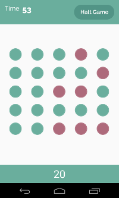
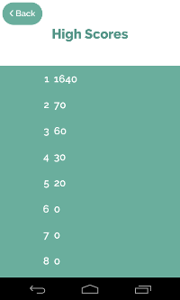

litupandroid
============

An Android game based on hitting lit up dots within a time limit. The entire project has been detailed out below, from start to finish.

__Author__: _Karanbir Randhawa_ (via karanbirrandhawa and smogi accounts).

# About the Game

The game was a great exercise in polishing my knowledge of the Android and a pretty fun way to spend some time. Originally it was to be a small hackathon project but since I didn't end up going I decided to dive into it at home on my spare time and have some fun with it. When I first started the project I had several features in my head that I knew I wanted done:

1. A Game Screen that consisted of a field of dots that would light up one by one until no dots remained or the time limit ran out.
2. To have the dots light up at changing speeds. I.e. 10 seconds in the dots start to light up faster, even faster 30 seconds in, etc.
3. The ability to pause, restart and quit the game.
4. The ability to record  the top ten scores ever  achieved on the phone.

At first I thought it'd be way too easy. These were some pretty small features and I was confident that I knew enough Java to code each of them. To top it off, I'd made an Android app before - a flash card app that showed the user a set of cards from a static library. It didn't have the finesse of an Android game but it had things like password protection for certain cards, crisp animations between cards that were flipped, etc. It turned out though that developing an Android game is far different from making an ordinary Android app.

# The Anatomy of an Android Game

The first time I really got stuck during this project was after I'd finished creating the main menu and different activities for each screen. I realized I wasn't really sure how exactly the structure of a game really worked. Where would I place my logic? Would it be possible, or even smart, to run the game thread seperately from the Activity/UI thread? What were the parts of the Android SDK that would help me do so? I did some research and thought about, ultimately deciding that there were to be two main components of the "game" part of my application.

* _The Game Loop_ or the central controller with which my logic would be centered in. It would run seperately from the UI thread through the support of `CountDownTimer` and `Runnable`. When the time came to interact with the UI, it would use Android's `runOnUiThread`.
* _The Activities_ or the frontend component. The user interacts with this area. For example, the tapping gesture that you would make on a dot would be including with this. Ideally the game loop would interact with this through `runOnUiThread` as specified above.

## The Game 

### GameController.java

## User Logic

### HighScoreManager.java

